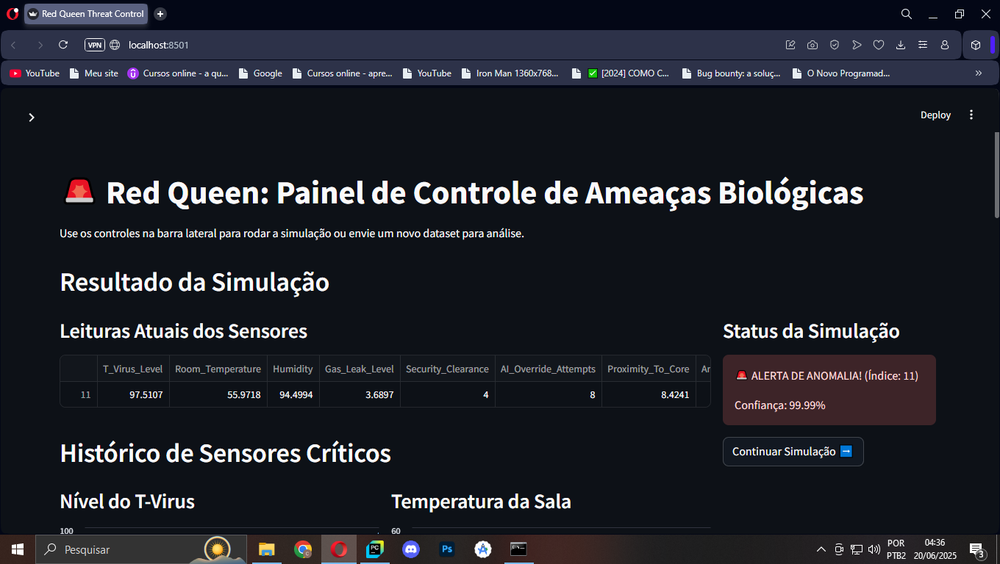
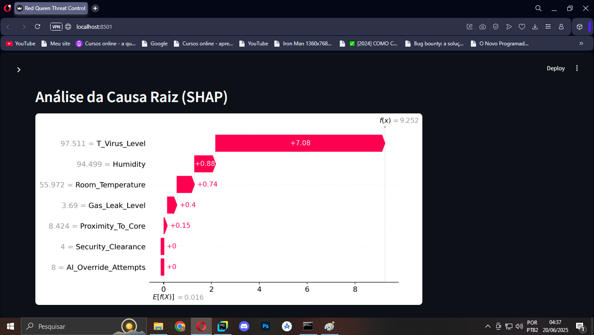
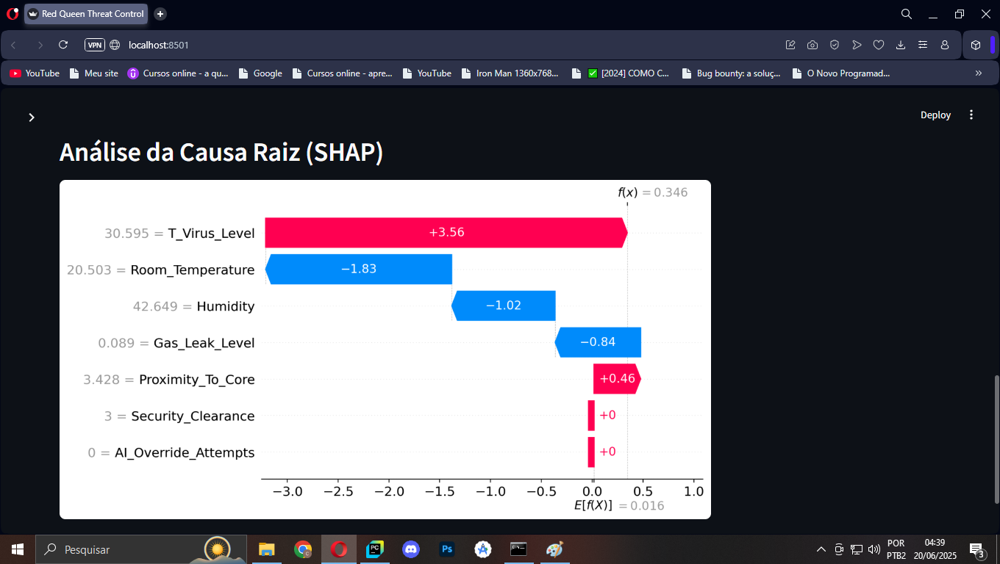

# ☣️ Red Queen: Painel de Detecção de Ameaças Biológicas






## 📜 Descrição do Projeto

Este projeto simula o painel de controle da "Rainha Vermelha", a inteligência artificial do universo de Resident Evil, encarregada de monitorar uma instalação de alto risco biológico. O objetivo é ir além da simples detecção de anomalias óbvias e ser capaz de identificar **ameaças silenciosas**: eventos críticos que se escondem em meio a dados aparentemente normais.

Utilizando um modelo de **XGBoost**, o sistema analisa dados de sensores em tempo real para classificar o estado da instalação como "Seguro" ou "Alerta de Anomalia". O grande diferencial do projeto é o uso de **SHAP (SHapley Additive exPlanations)** para fornecer uma análise de causa raiz instantânea, explicando *quais* sensores contribuíram para o alerta. Isso transforma a IA de um simples alarme em uma ferramenta de diagnóstico inteligente.

## ✨ Principais Funcionalidades

- **Monitoramento em Tempo Real:** Simula a leitura contínua de sensores ambientais e de segurança.
- **Detecção Inteligente:** Classifica anomalias, incluindo as "silenciosas" (onde apenas um sensor está em estado crítico(T_Virus_Level)).
- **IA Explicável (XAI):** Utiliza gráficos SHAP para explicar visualmente os motivos por trás de cada alerta de anomalia, identificando a causa raiz.
- **Painel Interativo:** Desenvolvido com Streamlit para uma experiência de usuário rica e intuitiva.
- **Análise de Dados Personalizada:** Permite o upload de novos datasets (arquivos `.csv`) para serem analisados pela IA.

## 🛠️ Tecnologias Utilizadas

- **Linguagem:** Python 3
- **Machine Learning:** Scikit-learn, XGBoost
- **IA Explicável (XAI):** SHAP
- **Análise de Dados:** Pandas, NumPy
- **Visualização de Dados:** Matplotlib, Seaborn
- **Dashboard Interativo:** Streamlit

## 🚀 Como Executar Localmente

Para rodar este projeto na sua máquina, siga os passos abaixo:

1.  **Clone o repositório:**
    ```bash
    git clone https://github.com/CarlosDevZera/red-queen-anomaly-detection.git
    ```

2.  **Navegue até a pasta do projeto:**
    ```bash
    cd red-queen-anomaly-detection
    ```

3.  **Crie e ative um ambiente virtual:**
    ```bash
    # Criar o ambiente
    python -m venv venv

    # Ativar no Windows
    venv\Scripts\activate
    ```

4.  **Instale as dependências:**
    ```bash
    pip install -r requirements.txt
    ```

5.  **Execute o aplicativo Streamlit:**
    ```bash
    streamlit run red_queen.py
    ```
    O painel abrirá automaticamente no seu navegador!

## 📂 Estrutura do Projeto

```
├── red_queen.py                  # Script principal do aplicativo Streamlit
├── evaluate_model.py             # Script para treinar e avaliar o modelo XGBoost
├── analise_exploratoria.py       # Script para a análise inicial e visualização dos dados
├── gerador_de_dataset.py         # Script que gera os dados sintéticos
├── requirements.txt              # Lista de dependências para instalação
├── .gitignore                    # Arquivo para especificar o que o Git deve ignorar
├── img/                          # Pasta com imagens usadas no projeto
└── .streamlit/                   # Pasta para configurações do Streamlit
```

## 📄 Licença

Este projeto está sob a licença MIT. Veja o arquivo [LICENSE](LICENSE) para mais detalhes.

## 👤 Contato

Carlos - [LinkedIn](https://www.linkedin.com/in/eucarlosalberto/)
